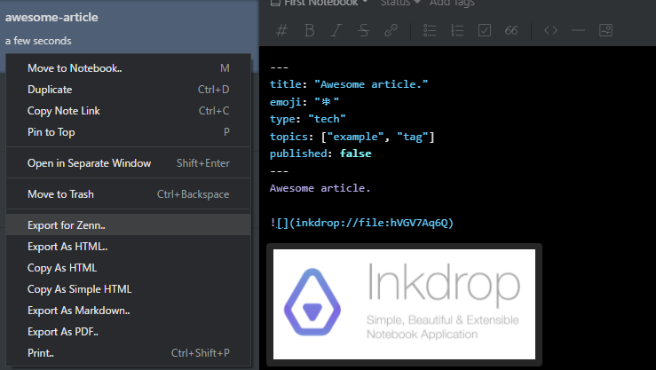

# Export for Zenn

This plugin makes it possible to export Inkdrop notes for Zenn CLI(https://zenn.dev/zenn/articles/zenn-cli-guide).
It is a fork of the [inkdrop-export-as-markdown](https://github.com/inkdropapp/inkdrop-export-as-markdown) plugin.



## Install

```
ipm install export-for-zenn
```

## Usage
1. Right-click on a note and select "Export for Zenn.."
2. Select path/to/your/zenn-cli/articles/article-slug-id.md

Then you can check the article by preview (npx zenn preview) and push to github for deploy.

The plugin works as follows:
- Export note body to path/to/your/zenn-cli/articles/article-slug-id.md
- Export images to path/to/your/zenn-cli/images/article-slug-id/images
- Correct the link to images.

The plugin does not:
- Check "slug" format.
- Check document format (headers, etc).
- Export for book.